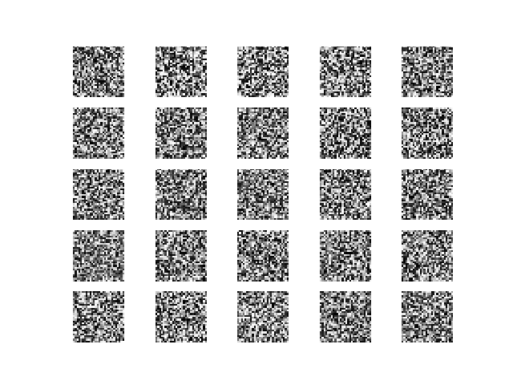

# 目标： 利用GAN生成生成fashion_mnist图片
## 整体效果
### 1.初始化的随机噪声

### 2.经过3000次迭代后的fashion_mnist

**已经初具外形**

## 实现方式：
### 1.keras 2.1.3
### 2.普通的神经网络
- 判别器网络为3个隐藏层：输入为图片，输出为图片判别的结果，1为real图片，0为fake
- 生成器网络为4个隐藏层
- 训练网络 将判别器和生成器连起来（固定判别器不训练）：输入为噪音，经生成器后贴上1的标签传入判别器，让fake照片尽可能拟合到real
## 不足：训练1000次和3000次差别不是很大